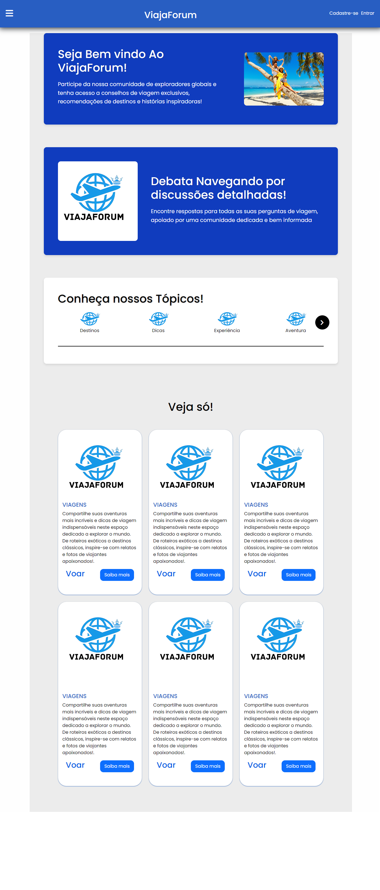

# ViajaForum

## Descrição
ViajaForum é um projeto de estudo proposto pelo [professor André](https://github.com/profAndreSouza). Consiste em um fórum desenvolvido com Laravel.

<details>
  <summary>Clique para ver a screenshot do projeto</summary>
  
  

</details>

## Instrução de Instalação

### Pré-requisitos
- **PHP**: Versão >= 7.4
- **Composer**: Gerenciador de dependências do PHP
- **MySQL**: Banco de dados
- **Servidor Web**: Apache ou Nginx

### Etapas
1. Clone o repositório:
   ```bash
   git clone https://github.com/joaocarpim/ViajaForumTAP.git

2. Instale as dependências do Composer:

   ```bash
   composer install

3. Gere a chave da aplicação:

   ```bash
   php artisan key:generate

5. Verifique o seguinte padrão no DB no arquivo .env:

   ```bash
   env
   DB_CONNECTION=mysql
   DB_HOST=127.0.0.1
   DB_PORT=3306
   DB_DATABASE=laravel
   DB_USERNAME=root
   DB_PASSWOR

6. Execute as migrações para criar as tabelas no banco de dados:

   ```bash
   php artisan migrate

7. Inicie o servidor de desenvolvimento:

   ```bash
   php artisan serve

## Requisitos Funcionais

### Registro de Usuário:
- Formulário de registro com campos para nome, email e senha.
- Validação dos campos (nome obrigatório, email válido e senha com mínimo de 8 caracteres).
- Armazenamento seguro das senhas utilizando hashing.
- Feedback ao usuário em caso de erros de validação.

### Login de Usuário:
- Formulário de login com campos para email e senha.
- Validação dos campos (email obrigatório e senha obrigatória).
- Verificação das credenciais de login.
- Redirecionamento do usuário autenticado para a página inicial.
- Feedback ao usuário em caso de falha na autenticação.

### Página Inicial:
- Acessível a todos os usuários (autenticados e não autenticados).
- Exibição de uma mensagem de boas-vindas personalizada com o nome do usuário.

### Logout:
- Função para encerrar a sessão do usuário.
- Redirecionamento para a página inicial após o logout.

## Requisitos Não Funcionais

### Página Inicial:
- Regiões reservadas para tópicos, postagens, etc.

### Tópico/ Postagens/ Tags:
- Funcionalidades para criar, editar, visualizar e excluir.

### Usuários (Moderação):
- Permite a moderação de usuários, incluindo opções para suspender e banir contas.

## Tecnologias

- **Framework**: Laravel
- **Linguagem**: PHP
- **Banco de Dados**: MySQL
- **Autenticação**: Pacote de autenticação padrão do Laravel

## Instrução de Uso

1. Acesse a página inicial do projeto.
2. Registre um novo usuário ou faça login com um usuário existente.
3. Navegue pelos tópicos e postagens.
4. Crie, edite e exclua tópicos e postagens conforme necessário.
5. Utilize as funcionalidades de moderação para gerenciar usuários (se você for um moderador).

## Licenças

Este projeto está licenciado sob a licença MIT. Para mais detalhes, consulte o arquivo [LICENSE](LICENSE) no repositório.

## Contribuidores

- João Vitor Aparecido Carpim de Souza
- [Kenui Engler de Oliveira Martins](https://github.com/kenui777)


